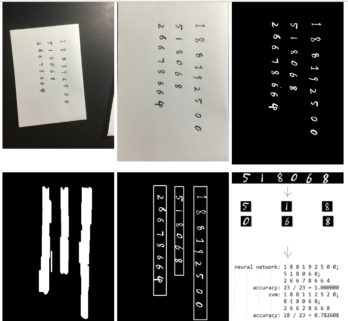

# Handwritten Digits Recognition
Automatically recognize handwritten digits from photos. Handwritten digits recognition by convolutional neural network and Support Vector Machine. Implement with Python, numpy and OpenCV.

For more details about the theory, implementation and results, please read [my post (in chinese)](https://hypjudy.github.io/2017/07/10/handwritten-digits-recognition/). Any feedback is welcomed!

## Method
We can do this in three steps. Firstly, segment strings of digits into digits one by one. Then train models/classifiers by CNN with TensorFlow and SVM with scikit-learn framework. Lastly, test and get results.

To segment digit strings, firstly we need to detect and crop paper sheet in photo (please refer to [A4-paper-sheet-detection-and-cropping](https://github.com/HYPJUDY/A4-paper-sheet-detection-and-cropping)). Secondly process image with binary conversion. Thirdly judge the handwritten direction to detect digit strings. Lastly segment digits in a digit string.

## Results
Dividing MNIST dataset into training and testing set, the accuracy of SVM can be 0.9852 and the accuracy of CNN can be 0.992. When testing on my own handwritten digits dataset, the accuracy is lower (~0.7 for SVM and ~0.9 for CNN).

| Data Number | 0 | 1 | 3 | 4 | 5+6+7 | average |
| :------: | :----: | :------: | :----: | :------: | :----: | :------: |
| SVM accuracy | 9 / 14 = 0.642857 | 8 / 17 = 0.470588 | 46 / 60 = 0.766667 | 28 / 39 = 0.717949 | 59 / 73 = 0.808219 | 150 / 203 = 0.738916 |
| CNN accuracy | 12 / 14 = 0.857143 | 10 / 17 = 0.588235 | 48 / 60 = 0.800000 | 32 / 39 = 0.820513 | 73 / 73 = 1.000000 | 175 / 203 = 0.862068 |
